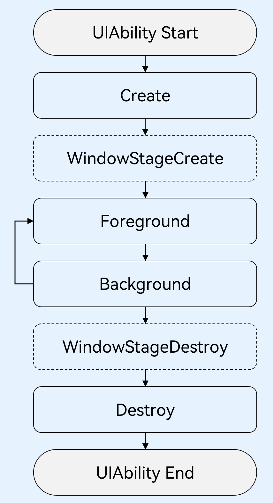

## UIAbility 
>UIAbility是一种包含用户界面的应用组件，主要用于和用户进行交互。UIAbility也是系统调度的单元，为应用提供窗口在其中绘制界面。
### 应用程序入口
- 点击桌面图标进入
- 一个应用拉起另一个应用
- 最近任务列表切回应用

### 系统调度的单元
- 一个应用可以有多个Ability，但是只有一个Ability是入口Ability，即MainAbility
- 将一个独立的功能模块放入一个Ability中
- 一个Ability可以有多个页面，即Page

### 页面路由跳转和通讯

>两个页面都需要引入`@ohos.router`，
> 通过 `router.pushUrl()` 或 `router.replaceUrl()`方法跳转页面
> 在API9，加了新的属性mode，用来设置跳转模式(单例和多例)，单例模式下，页面只会创建一次，多例模式下，每次都会创建新的页面
  - router.pushUrl() 不会销毁当前页面，跳转到新页面
    `注：页面栈过多（32）时调用router.clear()清空页面栈,只保留当前页面`
  - router.replaceUrl() 会销毁当前页面，跳转到新页面
> 通过`router.getRoute()`方法获取页面参数
> 通过`router.back()`方法可以返回上一页面，必须存在于页面栈中
  - router.back() 返回上一个页面
  - router.back({ url: 'pages/UIAbility/State', params: {src: 'Second页面传来的数据'}}) 返回到指定页面,并传递参数
> 通过`router.showAlertBeforeBackPage()`方法，可以在返回之前弹窗提示，必须在`router.back()`方法之前
> `router.hideAlertBeforeBackPage()`方法关闭该功能

```ArkTS
router.showAlertBeforeBackPage({
  message: 'Message Info'
});

router.back();
```

---

```ArkTS
// page1
// @ts-nocheck
import router from '@ohos.router';

let msg: string = 'Index页面传来的数据'

@Entry
@Component
struct State {
  @State message: string = 'State Page'
  build() {
    Row() {
      Column() {
       Text(this.message)
        Blank()
        Button('Next')
          .onClick(()=>{
            router.pushUrl({
              url: 'pages/UIAbility/Second',
              params:{
                src: msg
              }
            })
          })
      }
      .width('100%').height(140)
    }
    .height('100%').backgroundColor(0xF1F3F5)
  }
}
```

```ArkTS
// page2
import router from '@ohos.router';

@Entry
@Component
struct Second {
  @State message: string = 'Second Page'
  @State src: string = router.getParams()?.['src']

  build() {
    Row() {
      Column() {
        Text(this.message)
          .fontSize(50)
          .fontWeight(FontWeight.Bold)
        Text(this.src)
        Blank()
        Button('Back')
          .onClick(()=>{
            router.back()
          })
      }
      }
      .width('100%').height(140)
    }
    .height('100%').backgroundColor(0xF1F3F5)
  }
}
```

### 生命周期
>当用户浏览、切换和返回到对应应用的时候，应用中的UIAbility实例会在其生命周期的不同状态之间转换

>为了实现多设备形态上的裁剪和多窗口的可扩展性，系统对组件管理和窗口管理进行了解耦。UIAbility的生命周期包括Create、Foreground、Background、Destroy四个状态，WindowStageCreate和WindowStageDestroy为窗口管理器（WindowStage）在UIAbility中管理UI界面功能的两个生命周期回调，从而实现UIAbility与窗口之间的弱耦合。如下图所示。


- Create：在UIAbility实例创建时触发，系统会调用onCreate回调。可以在onCreate回调中进行相关初始化操作。
- WindowStageCreate：在UIAbility实例创建时触发，系统会调用onWindowStageCreate回调。每一个UIAbility实例都对应持有一个WindowStage实例。WindowStage为本地窗口管理器，用于管理窗口相关的内容，例如与界面相关的获焦/失焦、可见/不可见。
  >用来定义UIAbility的窗口属性，例如窗口大小、窗口位置、窗口透明度等。
  >可以在onWindowStageCreate回调中，设置UI页面加载、设置WindowStage的事件订阅。
  > 在onWindowStageCreate(windowStage)中通过loadContent接口设置应用要加载的页面。
- Foreground和Background状态：分别在UIAbility切换至前台或者切换至后台时触发。 分别对应于onForeground回调和onBackground回调。

 >onForeground回调，在UIAbility的UI页面可见之前，即UIAbility切换至前台时触发。可以在onForeground回调中申请系统需要的资源，或者重新申请在onBackground中释放的资源。

 >onBackground回调，在UIAbility的UI页面完全不可见之后，即UIAbility切换至后台时候触发。可以在onBackground回调中释放UI页面不可见时无用的资源，或者在此回调中执行较为耗时的操作，例如状态保存等。

-Destroy：在UIAbility销毁时触发。可以在onDestroy回调中进行系统资源的释放、数据的保存等操作。
 >例如用户使用应用的程序退出功能，会调用UIAbilityContext的terminalSelf()方法，从而完成UIAbility销毁。或者用户使用最近任务列表关闭该UIAbility实例时，也会完成UIAbility的销毁。

### 启动模式
>有三种启动模式：singleton（单实例模式）、multiton（多实例模式）和specified（指定实例模式）

- singleton（单实例模式）
> 对于浏览器或者新闻等应用，用户在打开该应用，并浏览访问相关内容后，回到桌面，再次打开该应用，显示的仍然是用户当前访问的界面。

```ArkTS
// 在module.json5文件中的“launchType”字段配置为“singleton”
{
   "module": {
     ...
     "abilities": [
       {
         "launchType": "singleton",
         ...
       }
     ]
  }
}
```
>startAbility()启动UIAbility会复用已经创建的Ability实例，而不是重新创建新的Ability实例。

- multiton（多实例模式）
>对于应用的分屏操作，用户希望使用两个不同应用（例如备忘录应用和图库应用）之间进行分屏，也希望能使用同一个应用（例如备忘录应用自身）进行分屏。

```ArkTS
// 在module.json5文件中的“launchType”字段配置为“multiton””
{
   "module": {
     ...
     "abilities": [
       {
         "launchType": "multiton",
         ...
       }
     ]
  }
}
```
>startAbility()启动UIAbility会创建新的Ability实例。

- specified（指定实例模式）
>对于文档应用，用户从文档应用中打开一个文档内容，回到文档应用，继续打开同一个文档，希望打开的还是同一个文档内容。

```ArkTS
// 在module.json5文件中的“launchType”字段配置为“specified”
{
   "module": {
     ...
     "abilities": [
       {
         "launchType": "specified",
         ...
       }
     ]
  }
}
```
> 内部定义创建单例还是多例的逻辑。